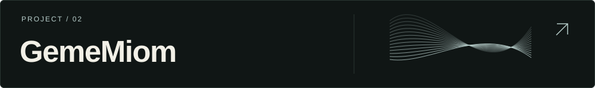
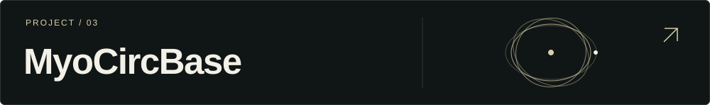
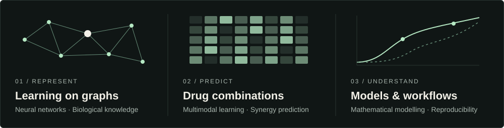
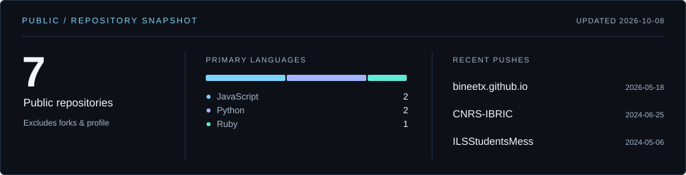

<picture>
  <source media="(max-width: 600px)" srcset="assets/banner-mobile.svg" />
  
</picture>

**Ph.D. Scholar · Computational Biology & Bioinformatics Lab**\
Institute of Life Sciences, Bhubaneswar

[Repositories ↗](https://github.com/BineetX?tab=repositories) &nbsp; / &nbsp; [Bioinformatica ↗](https://github.com/BineetX/Bioinformatica) &nbsp; / &nbsp; [GitHub ↗](https://github.com/BineetX)

### 01 / Projects

Microbial Genome Analysis Server. Bioinformatics workflows through a web interface.\
[Website ↗](https://genocular.dixitlab.org) · [Source ↗](https://github.com/BineetX/GENOCULAR)

<!-- Add your GemeMiom description here. -->
[Website ↗](https://www.gememiom.org)

<!-- Add your MyoCircBase description here. -->
[Source ↗](https://github.com/BineetX/MyoCIRCBase)

<!-- Add future projects here using a Markdown heading, description, and links. -->

[**Bioinformatica ↗**](https://github.com/BineetX/Bioinformatica) — A curated collection of bioinformatics tools, databases, books, pipelines, and tutorials.

### 02 / Research directions

<picture>
  <source media="(max-width: 600px)" srcset="assets/research-mobile.svg" />
  
</picture>

### 03 / Working stack

| Modelling | Scientific computing | Systems & workflows |
| :--- | :--- | :--- |
| PyTorch · PyTorch Geometric | Python · R | Linux · Bash · Git |
| Hugging Face Transformers | PostgreSQL | Docker · Snakemake · Slurm |

### 04 / Open-source activity

<a href="https://github.com/BineetX?tab=repositories">
  <picture>
    <source media="(max-width: 600px)" srcset="assets/activity-mobile.svg" />
    
  </picture>
</a>

Contribution animation

<picture>
  <source media="(prefers-color-scheme: dark)" srcset="assets/github-snake-dark.svg" />
  
</picture>

---

**Bineet Kumar Mohanta** &nbsp; / &nbsp; Biology · Computation · Discovery
