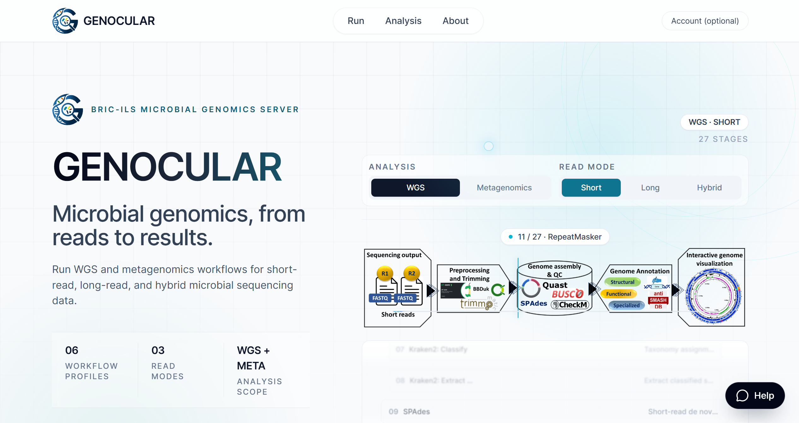
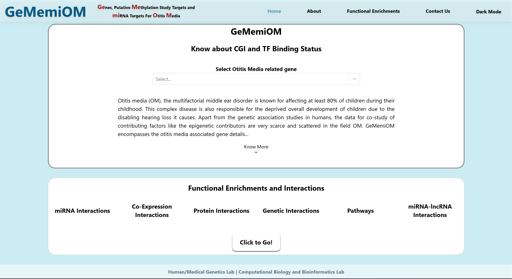

<picture>
  <source media="(max-width: 600px) and (prefers-reduced-motion: reduce)" srcset="assets/banner-mobile-still.svg" />
  <source media="(max-width: 600px)" srcset="assets/banner-mobile.svg" />
  <source media="(prefers-reduced-motion: reduce)" srcset="assets/banner-still.svg" />
  
</picture>

<!-- Edit the lines= parameter to change the rotating typing text. -->

  <picture>
    <source media="(prefers-color-scheme: dark)" srcset="https://readme-typing-svg.demolab.com?font=Fira+Code&amp;size=21&amp;duration=2800&amp;pause=1200&amp;color=7DD3FC&amp;center=true&amp;vCenter=true&amp;width=700&amp;height=48&amp;lines=Graph+Learning+for+Biological+Discovery;Exploring+Biological+Knowledge+Graphs;Building+Scientific+Tools" />
    
  </picture>

**Ph.D. Scholar · Computational Biology & Bioinformatics Lab**\
Institute of Life Sciences, Bhubaneswar

[Projects](#projects) &nbsp; · &nbsp; [Research](#research) &nbsp; · &nbsp; [Toolkit](#toolkit) &nbsp; · &nbsp; [Activity](#activity) &nbsp; · &nbsp; [All repositories ↗](https://github.com/BineetX?tab=repositories)

### Projects

<a href="https://genocular.dixitlab.org">
  <picture>
    <source media="(prefers-reduced-motion: reduce)" srcset="assets/genocular-still.svg" />
    
  </picture>
</a>

Microbial Genome Analysis Server. Bioinformatics workflows through a web interface.\
[Launch GENOCULAR ↗](https://genocular.dixitlab.org) · [Explore source ↗](https://github.com/BineetX/GENOCULAR)

Preview GENOCULAR

<a href="https://www.gememiom.org">
  <picture>
    <source media="(prefers-reduced-motion: reduce)" srcset="assets/gememiom-still.svg" />
    
  </picture>
</a>

<!-- Add your GemeMiom description here. -->
[Launch GemeMiom ↗](https://www.gememiom.org)

Preview GemeMiom

<a href="https://github.com/BineetX/MyoCIRCBase">
  <picture>
    <source media="(prefers-reduced-motion: reduce)" srcset="assets/myocircbase-still.svg" />
    
  </picture>
</a>

<!-- Add your MyoCircBase description here. -->
[Explore MyoCircBase ↗](https://github.com/BineetX/MyoCIRCBase)

<!-- Add future projects here using a Markdown heading, description, and links. -->

[**Bioinformatica ↗**](https://github.com/BineetX/Bioinformatica) — A curated collection of bioinformatics tools, databases, books, pipelines, and tutorials.

### Research

<picture>
  <source media="(max-width: 600px)" srcset="assets/research-mobile.svg" />
  
</picture>

### Toolkit

<picture>
  <source media="(prefers-color-scheme: dark)" srcset="https://skillicons.dev/icons?i=python,r,pytorch,linux,bash,docker,git,postgres&amp;theme=dark&amp;perline=8" />
  
</picture>

Models, infrastructure &amp; scientific workflows

| Modelling | Scientific computing | Systems & workflows |
| :--- | :--- | :--- |
| PyTorch · PyTorch Geometric | Python · R | Linux · Bash · Git |
| Hugging Face Transformers | PostgreSQL | Docker · Snakemake · Slurm |

### Activity

<picture>
  <source media="(prefers-color-scheme: dark)" srcset="assets/github-snake-dark.svg" />
  
</picture>

Public repository snapshot · updated daily

<a href="https://github.com/BineetX?tab=repositories">
  <picture>
    <source media="(max-width: 600px)" srcset="assets/activity-mobile.svg" />
    
  </picture>
</a>

---

**Bineet Kumar Mohanta** &nbsp; / &nbsp; Biology · Computation · Discovery
