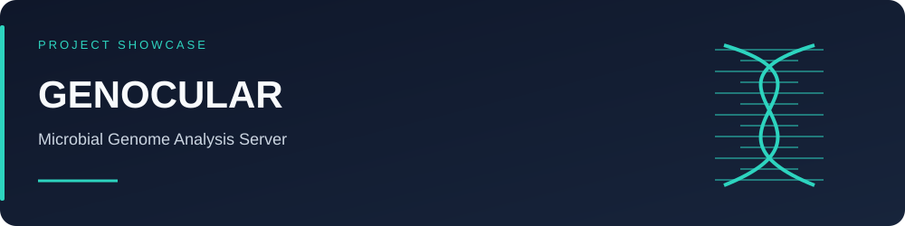
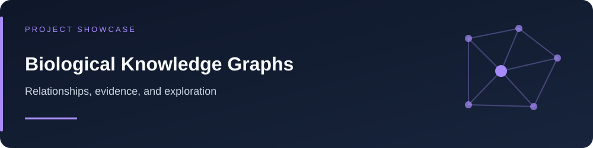
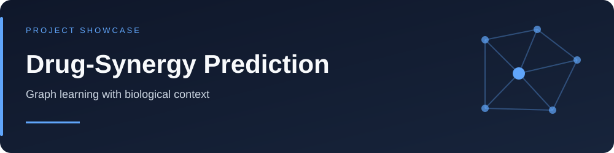

  

<!-- OPTIONAL CUSTOM BANNER: replace the Capsule image above with:

-->

  <strong>Ph.D. Scholar · Computational Biology &amp; Bioinformatics Lab</strong> 
  Institute of Life Sciences, Bhubaneswar

  

  
  
  

  <a href="https://github.com/BineetX?tab=repositories">Projects</a> ·
  <a href="#research-interests">Research interests</a> ·
  <a href="#tools-i-use">Tools</a> ·
  <a href="#connect">Connect</a>

## About me

I work at the intersection of biology, machine learning, and scientific software.
My interests include drug-combination prediction, graph learning, and exploring
biological knowledge through useful computational tools.

## Featured projects

### GENOCULAR

A microbial genome analysis server bringing bioinformatics workflows into a web interface.

**Focus:** microbial genomics · analysis workflows · scientific web applications

<!-- Add your actual URLs here; uncomment only after replacing placeholders.
[Code](GENOCULAR_REPOSITORY_URL) · [Demo](GENOCULAR_DEMO_URL) · [Documentation](GENOCULAR_DOCS_URL)
-->

### Biological knowledge-graph explorer

An exploratory project for navigating biological relationships and their supporting evidence.

**Focus:** knowledge graphs · GraphRAG · interactive exploration

<!-- [Code](KNOWLEDGE_GRAPH_REPOSITORY_URL) · [Demo](KNOWLEDGE_GRAPH_DEMO_URL) -->

### Drug-synergy prediction

Research into predicting cancer drug-combination responses using graph learning and biological context.

**Focus:** heterogeneous graphs · molecular representations · cell-line context

<!-- [Code](DRUG_SYNERGY_REPOSITORY_URL) · [Paper](DRUG_SYNERGY_PAPER_URL) -->

<!-- These SVGs are illustrative project covers, not screenshots or result figures.
For a stronger showcase, replace a cover with your actual screenshot or a short GIF.
-->

## Research interests

- Drug combinations and cancer-cell responses
- Graph neural networks and multimodal learning
- Biological knowledge graphs and evidence exploration
- Reproducible bioinformatics workflows

## Tools I use

<!-- Remove any tool that does not represent your current work. -->

  <picture>
    <source media="(prefers-color-scheme: dark)" srcset="https://skillicons.dev/icons?i=python,r,pytorch,linux,bash,docker,git,postgres&amp;theme=dark&amp;perline=8" />
    <source media="(prefers-color-scheme: light)" srcset="https://skillicons.dev/icons?i=python,r,pytorch,linux,bash,docker,git,postgres&amp;theme=light&amp;perline=8" />
    
  </picture>

  
  
  
  

<!-- OPTIONAL: Awards, fellowships, publications, and certificates.
Replace the examples with genuine accomplishments and evidence links.
Remove this comment wrapper when you have filled in the section.

## Selected achievements

- **YOUR ACHIEVEMENT** — brief context, year, and [evidence](EVIDENCE_URL).
-->

<!-- OPTIONAL AUTOMATED PANELS: Set up metrics.yml and METRICS_TOKEN first.
After both SVG files have been generated, remove this comment wrapper.
These third-party highlights are separate from GitHub's native achievements.

## GitHub highlights

  

  
Activity achievements

  

    
  

-->

## Connect

Find my public projects and activity on [GitHub](https://github.com/BineetX).

<!-- Add real profile links, then remove this comment wrapper.
[ORCID](YOUR_ORCID_URL) · [Google Scholar](YOUR_SCHOLAR_URL) · [LinkedIn](YOUR_LINKEDIN_URL) · [Email](mailto:YOUR_EMAIL)
-->

## Contribution trail

<!-- This appears after the Generate contribution snake workflow succeeds. -->

  <picture>
    <source media="(prefers-color-scheme: dark)" srcset="https://raw.githubusercontent.com/BineetX/BineetX/output/github-snake-dark.svg" />
    <source media="(prefers-color-scheme: light)" srcset="https://raw.githubusercontent.com/BineetX/BineetX/output/github-snake.svg" />
    
  </picture>

